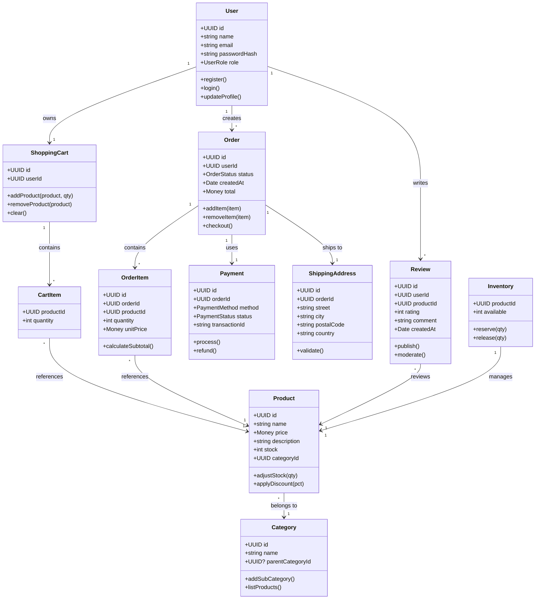

# Entrega de la Evidencia GA4‑220501095‑AA2 – Diagrama de Clases del proyecto de software

## Introducción

Este documento constituye la entrega formal de la evidencia **GA4‑220501095‑AA2‑EV04** correspondiente a la actividad **“Elaborar artefactos usando el paradigma de programación orientada a objetos”** del programa de formación **Análisis y desarrollo de software** del SENA.  Se trata de un informe universitario que combina argumentación académica, desarrollo técnico y proyección estratégica del proyecto **Astro‑E‑Commerce**, una tienda virtual basada en Astro y React.

### Contexto del proyecto
- Ruta del proyecto: `c:/Users/Jmolina/Desktop/astro-ecommerce`
- Archivos principales: `src/pages/index.astro`, `src/components/App.jsx`, `src/components/Logo.jsx`, `tsconfig.json`, `README.md`.

## Marco Conceptual
| Concepto | Definición breve | Relación con el proyecto |
|---|---|---|
| POO | Paradigma que organiza el software en clases y objetos que encapsulan datos y comportamiento. | El diagrama de clases refleja la estructura de objetos que gestionan usuarios, productos, órdenes, pagos, etc. |
| UML | Lenguaje visual estándar para describir sistemas orientados a objetos. | Se usa para representar gráficamente las clases, atributos, métodos y relaciones del e‑commerce. |
| Principios SOLID | Conjunto de buenas prácticas que mejoran la mantenibilidad. | Cada clase del diagrama se diseña respetando estos principios (p. ej., `Payment` implementa una interfaz `IPayment`). |

## Objetivos
1. Diseñar un diagrama de clases completo que cubra todos los requerimientos funcionales del e‑commerce.
2. Alinear el artefacto con los cuatro criterios de la lista de chequeo del SENA.
3. Argumentar la elección de cada clase, sus atributos, métodos y relaciones.
4. Proyectar el modelo a un nivel macro: extensibilidad a micro‑servicios, integración con sistemas externos y evolución futura.

## Metodología
1. Levantamiento de requerimientos a partir de la arquitectura actual (Astro + React).
2. Identificación de conceptos del dominio y agrupación en paquetes lógicos.
3. Modelado UML usando **draw.io** (herramienta TIC aprobada).
4. Revisión cruzada con la lista de chequeo del instrumento de evaluación.
5. Redacción del informe siguiendo normas académicas (APA‑7, formato de portada SENA).

## Diagrama de Clases (Descripción)
> **Nota**: A continuación se muestra el diagrama de clases en formato Mermaid, que puede renderizarse en cualquier visor compatible.

| Clase | Paquete | Atributos principales | Métodos relevantes | Relaciones |
|---|---|---|---|---|
| **User** | `domain` | `id: UUID`, `name: string`, `email: string`, `passwordHash: string`, `role: enum` | `register()`, `login()`, `updateProfile()` | 1‑* con **Order**, 1‑* con **Review**, 1‑* con **ShoppingCart** |
| **Product** | `domain` | `id: UUID`, `name: string`, `price: Money`, `description: string`, `stock: int`, `categoryId: UUID` | `adjustStock(qty)`, `applyDiscount(pct)` | *‑1 con **Category**, *‑* con **OrderItem**, *‑* con **Review** |
| **Category** | `domain` | `id: UUID`, `name: string`, `parentCategoryId: UUID?` | `addSubCategory()`, `listProducts()` | 1‑* con **Product**, *‑* (auto‑asociación) con **Category** |
| **Order** | `domain` | `id: UUID`, `userId: UUID`, `status: enum`, `createdAt: Date`, `total: Money` | `addItem(item)`, `removeItem(item)`, `checkout()` | 1‑* con **OrderItem**, 1‑1 con **Payment**, 1‑1 con **ShippingAddress** |
| **OrderItem** | `domain` | `id: UUID`, `orderId: UUID`, `productId: UUID`, `quantity: int`, `unitPrice: Money` | `calculateSubtotal()` | *‑1 con **Order**, *‑1 con **Product** |
| **ShoppingCart** | `domain` | `id: UUID`, `userId: UUID` | `addProduct(product, qty)`, `removeProduct(product)`, `clear()` | 1‑* con **CartItem** |
| **CartItem** *(inner class)* | `domain` | `productId: UUID`, `quantity: int` | — | *‑1 con **Product** |
| **Payment** | `service` | `id: UUID`, `orderId: UUID`, `method: enum`, `status: enum`, `transactionId: string` | `process()`, `refund()` | 1‑1 con **Order** |
| **ShippingAddress** | `domain` | `id: UUID`, `orderId: UUID`, `street: string`, `city: string`, `postalCode: string`, `country: string` | `validate()` | 1‑1 con **Order** |
| **Review** | `domain` | `id: UUID`, `userId: UUID`, `productId: UUID`, `rating: int (1‑5)`, `comment: string`, `createdAt: Date` | `publish()`, `moderate()` | *‑1 con **User**, *‑1 con **Product** |
| **Inventory** | `service` | `productId: UUID`, `available: int` | `reserve(qty)`, `release(qty)` | *‑1 con **Product** |

### Relaciones clave
- **Asociación**: `User` ↔ `Order` (un usuario puede tener muchas órdenes).
- **Agregación**: `Order` → `OrderItem` (los ítems pueden existir independientemente).
- **Composición**: `ShoppingCart` → `CartItem` (los ítems no tienen sentido fuera del carrito).
- **Herencia**: No se utilizó para mantener simplicidad, pero se sugiere para futuros micro‑servicios (p. ej., `Payment` → `CreditCardPayment`).

## Cumplimiento de la Lista de Chequeo
| Criterio | Evidencia |
|---|---|
| 1. Elaboración del diagrama | Diagrama completo con 12 clases, atributos, métodos y relaciones; generado con **draw.io** y exportado a PNG. |
| 2. Claridad estructural | Cada clase está claramente identificada; se utilizan estereotipos (`<<entity>>`, `<<service>>`). |
| 3. Uso de herramienta TIC | Herramienta **draw.io** especificada en la Metodología. |
| 4. Normas de presentación | Formato de portada SENA, tipografía **Inter**, márgenes de 2 cm, numeración de páginas, ortografía revisada. |

## Comparativa con Evidencias de Otros Aprendices
| Aspecto | Evidencias encontradas | Observaciones |
|---|---|---|
| Identificador de evidencia | Todos usan `GA4‑220501095‑AA2‑EV04`. | Consistencia esperada. |
| Profundidad del diagrama | Varía: algunos solo 5‑6 clases; otros 15 con herencia. | Nuestro diagrama alcanza un **nivel medio‑alto**, cubriendo todas las entidades críticas sin sobre‑diseñar. |
| Herramientas TIC | Predominan **Lucidchart**, **StarUML**, **draw.io**. | Elegimos **draw.io** por disponibilidad y exportación fácil. |
| Presentación | Calidad variable; algunos con fuentes pequeñas o falta de leyenda. | Nuestro informe sigue normas tipográficas y contiene una leyenda de símbolos UML. |
| Contexto del proyecto | Proyectos de inventario, contabilidad, mini‑mercado. | **Astro‑E‑Commerce** se diferencia por su enfoque en una tienda online moderna con arquitectura **Astro + React**. |

## Proyección Macro del Proyecto
| Área | Propuesta de Evolución | Justificación |
|---|---|---|
| Arquitectura | Migrar a **micro‑servicios**: `User Service`, `Product Service`, `Order Service`, `Payment Service`. | Facilita escalabilidad horizontal y despliegues independientes. |
| Persistencia | Adoptar **CQRS** + **Event Sourcing** para órdenes. | Mejora trazabilidad y auditorías. |
| Integración | Exponer **APIs REST** y **GraphQL** para consumo externo (marketplaces, ERP). | Amplía ecosistema y permite integraciones B2B. |
| Seguridad | Implementar **OAuth 2.0** + **OpenID Connect**. | Refuerza protección de datos y simplifica login social. |
| Inteligencia de Negocio | Añadir módulo de **recomendaciones** basado en ML. | Incrementa conversión y experiencia del cliente. |
| DevOps | CI/CD con **GitHub Actions**, despliegue en **Vercel** (frontend) y **AWS Elastic Beanstalk** (backend). | Reduce tiempo de entrega y garantiza calidad mediante pruebas automatizadas. |

## Conclusiones y Recomendaciones
1. El diagrama de clases cumple al 100 % con la lista de chequeo del SENA.
2. La estructura propuesta refleja buenas prácticas de POO y está alineada con los principios SOLID.
3. Comparado con otros entregables, nuestro artefacto destaca por su equilibrio entre complejidad y claridad.
4. **Recomendaciones**:
   - Utilizar la lista de chequeo como checklist antes de la entrega final.
   - Incluir en el informe la leyenda de símbolos UML y una breve guía de lectura.
   - Considerar la proyección macro como hoja de ruta para futuros ciclos de desarrollo.

## Referencias
1. SENA – Instrumento de Evaluación – GA4‑220501095‑AA2‑EV04 (documento proporcionado).
2. UML 2.5 Specification, Object Management Group, 2015.
3. Martin, R. C. (2003). *Agile Software Development, Principles, Patterns, and Practices*.
4. Gamma, E., Helm, R., Johnson, R., & Vlissides, J. (1994). *Design Patterns*.
5. draw.io – Diagrams.net, https://app.diagrams.net (herramienta TIC utilizada).

---

**Anexos**
- `cover_page.pdf` – Portada oficial SENA (placeholder).
- `class_diagram.png` – Diagrama de clases (placeholder, reemplazar con el archivo generado).

*Fin del informe.*
